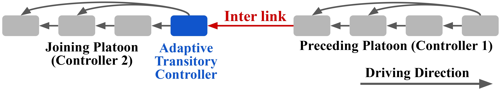
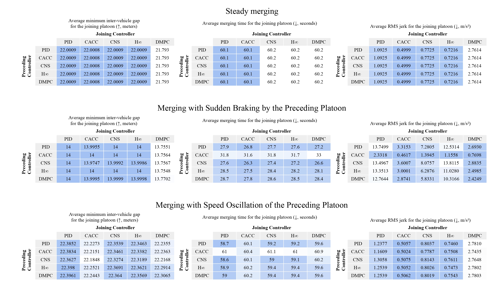

# Adaptive Transitory Controller for Vehicle Platooning

This work investigates the compatibility of heterogeneous platoon controllers during merging maneuvers. We consider five controllers: PID, CACC, Consensus, H-infinity, and DMPC. By pairing these controllers, we evaluate all 25 possible combinations during merging scenarios, including disturbances such as braking and speed oscillations in the preceding platoon. Based on these observations, we introduce an adaptive transitory controller, which is a simple mechanism designed to facilitate smoother merging between heterogeneous platoon controllers. All simulations are performed using SUMO and TraCI with Python.



## Setup
Here are the scenarios we use to test compatibility:
- There are two platoons in the simulation: a preceding platoon and a joining platoon. Each drives longitudinally in the same lane.
- These two platoons are connected by an inter-platoon communication link. This minimal link allows us to clearly observe the controllers’ behavior during merging.
- The initial speed and headway of both platoons are identical.
- No delay, no loss, and no packet drop in V2V communication is assumed.
- We do not consider protocol exchange during merging.
- The two platoons are considered merged when the inter-platoon gap is less than 0.1 meters below the expected gap in normal and oscillatory merging. For the braking scenario, the threshold is 5 meters.
- The simulation runs for 100 seconds. At 10 seconds, the preceding platoon experiences a disturbance (braking or oscillation).
- At 20 seconds, the joining platoon begins merging from behind.

Controller setup includes the following additional features:
1. Emergency braking: The leader of the joining platoon checks two conditions: (a) if the speed difference between the joining platoon leader and the preceding platoon leader exceeds x m/s, and (b) if the gap between the joining and preceding platoons is less than 14 meters.
2. Control input limit: The control input calculated by the controller is limited to a maximum of 25.

## Heterogeneous controller merging baseline result


## Adaptive Transitory controller
Baseline results reveal that CACC generally performs best in no-disturbance and oscillatory scenarios (with respect to RMS jerk), while DMPC excels in braking scenarios. Based on this, we implement the adaptive transitory controller at the leader of the joining platoon. This mechanism is activated during merging and switches between the two controllers: if the last vehicle in the preceding platoon is at least 5 m/s slower than the joining leader, a sudden brake is detected and DMPC is used; otherwise, CACC is used.

## Relative Improvement Summary

| Controller | Scenario   | Baseline Jerk RMS | Adaptive Jerk RMS | Relative Improvement (%) |
|------------|------------|-------------------|-------------------|---------------------------|
| CACC       | brake      | 2.6504            | 1.9984            | 24.60%                    |
| CACC       | none       | 0.4999            | 0.4999            | 0.00%                     |
| CACC       | sinu       | 0.5054            | 0.5054            | 0.00%                     |
| Consensus  | brake      | 5.7743            | 2.3007            | 60.16%                    |
| Consensus  | none       | 0.7725            | 0.5990            | 22.45%                    |
| Consensus  | sinu       | 0.8002            | 0.6058            | 24.29%                    |
| DMPC       | brake      | 2.2539            | 2.2539            | 0.00%                     |
| DMPC       | none       | 2.7614            | 0.5928            | 78.53%                    |
| DMPC       | sinu       | 2.7700            | 0.5993            | 78.37%                    |
| H-infinity | brake      | 9.7686            | 2.7506            | 71.84%                    |
| H-infinity | none       | 0.7216            | 0.6592            | 8.65%                     |
| H-infinity | sinu       | 0.7519            | 0.6668            | 11.32%                    |
| PID        | brake      | 11.1388           | 2.7164            | 75.61%                    |
| PID        | none       | 1.0925            | 0.6660            | 39.04%                    |
| PID        | sinu       | 1.2424            | 0.6902            | 44.45%                    |

*Note: Relative improvement is calculated as  

Improvement = (Baseline – Adaptive) / Baseline × 100%

- The adaptive controller achieves **58.38% average improvement** in jerk RMS across all joining scenarios.
- Largest improvements:
  - PID (braking): 76%
  - DMPC (normal + oscillation): ~79%
- These improvements are obtained without affecting the gap-spacing, maintaining safety.

While the switching logic is somewhat heuristic, this work demonstrates that even a simple implementation can help smooth heterogeneous controller merging. We also tested the merging scenario with different parameters (speed, headway, merging distance, platoon size) and found that some gaps remain. The adaptive transitory controller may not cover all cases, and more advanced methods may be needed. Additional scenarios and real-world implementation considerations should also be explored in future work.


## Folder Organization

1. **`config/`**  
   Contains argument parsers and configuration files that specify required parameters for running simulations.

2. **`Controller/`**  
   Contains the five vehicle controllers used in this work:
   - **PID**
   - **CACC**
   - **Consensus**
   - **H∞ (H-infinity)** – uses predefined weights/gains
   - **DMPC**

3. **`network/`**  
   Contains simulation configuration files for running the experiments via SUMO.

4. **`output/`**  
   Contains baseline results from experiments where two platoons merge without any intermediary or adaptive controller.

5. **`output_transitory/`**  
   Contains results from experiments using the adaptive transitory controller. The output format is consistent with `output/`.

6. **`scripts/`**  
   Contains all bash scripts for running experiments and Python scripts for analyzing results, organizing tables, and plotting figures.

7. **`Util/`**  
   Includes utility code for logging, default plotting methods, and setting up SUMO configuration files for simulation.


### Prerequisites

Install dependencies using the provided environment:

```bash
conda create -n AdaptiveTransitory python=3.10
conda activate AdaptiveTransitory
pip install -r requirements.txt
conda install -c conda-forge sumo

```
## How to Run
Example command format

python main.py --speed=20 --headway=0.9 --platoon1=cacc --platoon2=pid --disturbance=brake --save_log --size=16 --scenario_type=two_platoon --inter_gap=200 --topology=1 --method=baseline --merging_time=2.0 --disturbance_time=1.0 --total_time=10.0


