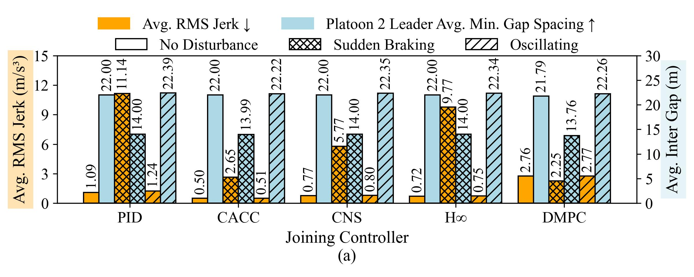
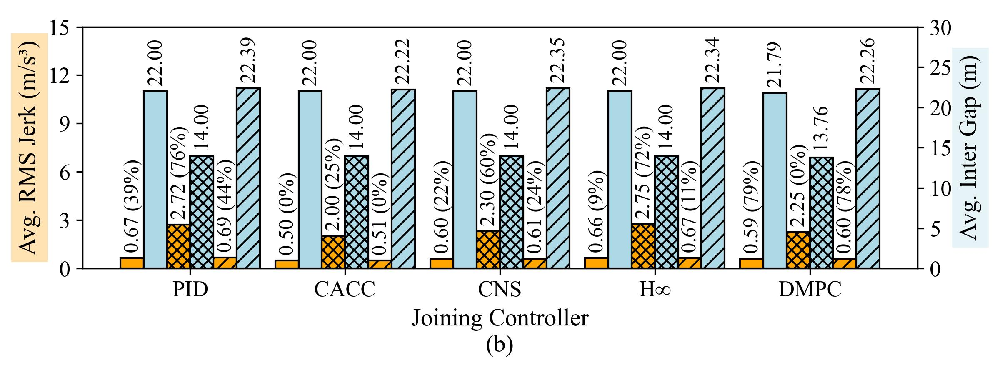

# Adaptive Transitory Controller for Vehicle Platooning

## Abstract

This work aims to investigate and study how would different platoon controller needs to react without any intermeditary especially for merging scenario. Different controller platoon merging presents in mismatch controller type and may cause 


## Raw Result


## Analysis
Baseline Result


Improved result with Adaptive Transitory Controller


- The adaptive controller achieves **58.38% average improvement** in jerk RMS across all joining scenarios.
- Largest improvements:
  - PID (braking): 76%
  - DMPC (normal + oscillation): ~79%
- These improvements are obtained without affecting the gap-spacing, maintaining safety.

## Relative Improvement Summary

| Controller | Scenario   | Baseline Jerk RMS | Adaptive Jerk RMS | Relative Improvement (%) |
|------------|------------|-------------------|-------------------|---------------------------|
| CACC       | brake      | 2.6504            | 1.9984            | 24.60%                    |
| CACC       | none       | 0.4999            | 0.4999            | 0.00%                     |
| CACC       | sinu       | 0.5054            | 0.5054            | 0.00%                     |
| Consensus  | brake      | 5.7743            | 2.3007            | 60.16%                    |
| Consensus  | none       | 0.7725            | 0.5990            | 22.45%                    |
| Consensus  | sinu       | 0.8002            | 0.6058            | 24.29%                    |
| DMPC       | brake      | 2.2539            | 2.2539            | 0.00%                     |
| DMPC       | none       | 2.7614            | 0.5928            | 78.53%                    |
| DMPC       | sinu       | 2.7700            | 0.5993            | 78.37%                    |
| H-infinity | brake      | 9.7686            | 2.7506            | 71.84%                    |
| H-infinity | none       | 0.7216            | 0.6592            | 8.65%                     |
| H-infinity | sinu       | 0.7519            | 0.6668            | 11.32%                    |
| PID        | brake      | 11.1388           | 2.7164            | 75.61%                    |
| PID        | none       | 1.0925            | 0.6660            | 39.04%                    |
| PID        | sinu       | 1.2424            | 0.6902            | 44.45%                    |

*Note: Relative improvement is calculated as  
\[
\text{Improvement} = \frac{\text{Baseline} - \text{Adaptive}}{\text{Baseline}} \times 100\%
\]*

## 📁 Folder Organization

1. **`config/`**  
   Contains argument parsers and configuration files that specify required parameters for running simulations.

2. **`Controller/`**  
   Contains the five vehicle controllers used in this work:
   - **PID**
   - **CACC**
   - **Consensus**
   - **H∞ (H-infinity)** – uses predefined weights/gains
   - **DMPC**

3. **`network/`**  
   Contains simulation configuration files for running the experiments via SUMO.

4. **`output/`**  
   Contains baseline results from experiments where two platoons merge without any intermediary or adaptive controller.

5. **`output_transitory/`**  
   Contains results from experiments using the adaptive transitory controller. The output format is consistent with `output/`.

6. **`scripts/`**  
   Contains all bash scripts for running experiments and Python scripts for analyzing results, organizing tables, and plotting figures.

7. **`Util/`**  
   Includes utility code for logging, default plotting methods, and setting up SUMO configuration files for simulation.


### Prerequisites

Install dependencies using the provided environment:

```bash
conda create -n AdaptiveTransitory python=3.10
conda activate AdaptiveTransitory
pip install -r requirements.txt
```
## How to Run
Example command format

python main.py --speed=20 --headway=0.9 --platoon1=cacc --platoon2=pid --disturbance=brake --save_log --size=16 --scenario_type=two_platoon --inter_gap=200 --topology=1 --method=baseline --merging_time=2.0 --disturbance_time=1.0 --total_time=10.0


