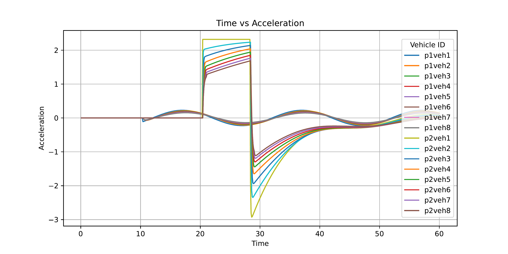

# Adaptive Transitory Controller for Vehicle Platooning

This work investigates the compatibility of heterogeneous platoon controllers during merging maneuvers. We consider five controllers: PID, CACC, Consensus, H-infinity, and DMPC. By pairing these controllers, we evaluate all 25 possible combinations during merging scenarios, including disturbances such as braking and speed oscillations in the preceding platoon. Based on these observations, we introduce an adaptive transitory controller, which is a simple mechanism designed to facilitate smoother merging between heterogeneous platoon controllers. All simulations are performed using SUMO and TraCI with Python.


## Setup
Here are the scenarios we use to test compatibility:
- There are two platoons in the simulation: a preceding platoon and a joining platoon. Each drives longitudinally in the same lane.
- These two platoons are connected by an inter-platoon communication link. This minimal link allows us to clearly observe the controllers’ behavior during merging.
- The initial speed and headway of both platoons are identical.
- No delay, no loss, and no packet drop in V2V communication is assumed.
- We do not consider protocol exchange during merging.
- The two platoons are considered merged when the inter-platoon gap is less than 0.1 meters below the expected gap in normal and oscillatory merging. For the braking scenario, the threshold is 5 meters.
- The simulation runs for 100 seconds. At 10 seconds, the preceding platoon experiences a disturbance (braking or oscillation).
- At 20 seconds, the joining platoon begins merging from behind.

Controller setup includes the following additional features:
1. Emergency braking: The leader of the joining platoon checks two conditions: (a) if the speed difference between the joining platoon leader and the preceding platoon leader exceeds x m/s, and (b) if the gap between the joining and preceding platoons is less than 14 meters.
2. Control input limit: The control input calculated by the controller is limited to a maximum of 25.

The controller gains used in this work are based on established literature for each of the five controllers:

1. **PID**: Parameters adopted from [Dasgupta et al., 2017](https://ieeexplore.ieee.org/document/8280871).
The PID controller is a classical feedback controller that combines proportional, integral, and derivative terms of both the leader and the predecessor to minimize spacing, speed, and acceleration errors. It is a reactive controller—output is based solely on the current and past states, not on prediction of future behavior. Gains are tuned to ensure stability and fast response without overshoot.

$$
a_\text{des}^{\mathrm{PID}} = 
\frac{
    K_d(a_\text{leader} + a_\text{pred}) + K_{p,\text{leader}} (v_\text{leader} - v_\text{ego}) \\
    + K_{p,\text{front}} (v_\text{pred} - v_\text{ego}) + K_{i,\text{front}} (d_\text{gap} - d_\text{safe}) \\
    + K_{i,\text{leader}} (d_\text{gap,leader} - d_\text{safe,leader})
}{
    0.01\, v_\text{ego} + 2K_d
}.
$$

Gains:
$K_{p,\text{front}}=285$, $K_{p,\text{leader}}=120$, $K_{i,\text{leader}}=9$, $K_{i,\text{front}}=67$, $K_d=2.4$

2. **CACC**: Standard parameterization following [Arem et al., 2006](https://ieeexplore.ieee.org/document/4019451).

The Cooperative Adaptive Cruise Control (CACC) controller uses feedback from both the immediate predecessor and the platoon leader to adjust acceleration, aiming to maintain safe distance and string stability. This is a reactive controller enhanced with feedforward terms for leader acceleration, improving responsiveness to changes up the platoon.

$$
a_\text{des}^{\mathrm{CACC}} = K_p (d_\text{gap} - d_\text{safe}) + K_v (v_\text{pred} - v_\text{ego}) + K_a\, a_\text{leader} + K_d (a_\text{pred} - a_\text{ego}).
$$

Gains:
$K_p=1.88$, $K_v=12$, $K_a=1$, $K_d=3$

3. **Consensus**: Based on controller design in [Santini et al., 2018](https://ieeexplore.ieee.org/document/8574948).
The Consensus controller is designed for distributed agreement among vehicles, using both leader and predecessor information to harmonize speed and gaps across the platoon. It is reactive but leverages more global platoon information, seeking consensus on velocity and distance to avoid large fluctuations or fragmentation.

$$ a_\text{des}^{\mathrm{CNS}} = - B (v_\text{ego} - v_\text{leader}) + \frac{ -K_\text{leader} d_\text{safe,leader} - K_\text{pred} d_\text{safe} }{ d_i } + \frac{ K_\text{leader} d_\text{gap,leader} + K_\text{pred} d_\text{gap} }{ d_i }. $$

Gains:
$B=30$, $K_{\text{pred}}=5.41$, $K_{\text{leader}}=5.41$

4. **H-infinity**: Weighting coefficients are set according to [Zheng, 2017](https://arxiv.org/abs/1611.01412), with minor adjustments for our scenario. Note: We do not solve the LMI (Linear Matrix Inequality) for optimal gains, but instead use the published fixed weights as recommended in the paper.
The H-infinity ($\mathcal{H}^\infty$) controller optimizes robustness against worst-case disturbances, balancing errors in gap, speed, and acceleration from both leader and predecessor. This is a robust optimal controller, typically tuned via optimization, but here uses published fixed gains. It is still reactive but emphasizes disturbance rejection and robustness.

$$
a_\text{des}^{\mathcal{H}^\infty} =
K_1
\begin{bmatrix}
d_\text{gap,leader} - d_\text{safe,leader} \\
v_\text{leader} - v_\text{ego} \\
a_\text{leader} - a_\text{ego}
\end{bmatrix}
+
K_2
\begin{bmatrix}
d_\text{gap} - d_\text{safe} \\
v_\text{pred} - v_\text{ego} \\
a_\text{pred} - a_\text{ego}
\end{bmatrix}.
$$

Gains:
$K_1 = [2.377,, 3.425,, 2.501]$,
$K_2 = [2.377,, 4\times3.425,, 2.501]$

5. **DMPC**: Implementation and gain selection inspired by [An et al., 2023](https://ieeexplore.ieee.org/document/10074981).

The Distributed Model Predictive Control (DMPC) is a predictive controller that optimizes a cost function over a finite time horizon. At each control step, it computes the sequence of future accelerations for the ego vehicle to minimize the total cost, which penalizes deviations in spacing, speed, and acceleration relative to both the leader and predecessor. The controller selects the first action (acceleration) of the optimal sequence as $a_\text{des}$, then repeats this process at the next timestep. The approach enables anticipation of future events (e.g., leader braking), achieving smoother and safer platoon maneuvers.

$$
\begin{aligned}
\textbf{cost} \; {+}{=} \; & 
q_{d,\text{leader}} (d_\text{leader} - d_\text{ego} - d_{\text{safe,leader}})^2 \\
& + q_{d,\text{front}} (d_\text{pred} - d_\text{ego} - d_\text{safe})^2 \\
& + q_{v,\text{front}} (v_\text{pred} - v_\text{ego})^2 \\
& + q_{a,\text{front}} \left( \frac{a_\text{leader} - a_\text{ego} + a_\text{pred} - a_\text{ego}}{2} \right)^2 \\
& + q_{v,\text{leader}} (v_\text{leader} - v_\text{ego})^2 \.
\end{aligned}
$$

Gains:
$q_{d,\text{leader}}=10.15$, $q_{d,\text{front}}=7$, $q_{v,\text{front}}=9$, $q_{a,\text{front}}=1.8$, $q_{v,\text{leader}}=9$, $horizon=4$

> **Note:**  
> The controller implementations are not exact replications of the referenced papers, but use their recommended settings as guidelines for practical tuning.

## Heterogeneous controller merging baseline result


The parameter tuning of all five controllers in this study is based on a joining time reference of 60 seconds from the simulation start. Two controllers are configured to merge in each scenario.

**Steady Merge (No Disturbance):**
In the steady merging scenario, where there is no disturbance, the type of preceding platoon does not significantly impact the joining platoon’s performance. All controllers can maintain their desired gaps and speeds effectively, as the system remains predictable. However, DMPC as a joiner tends to result in a slightly smaller average minimum gap and higher jerk. This is because DMPC, being predictive, sometimes fills the gap more aggressively to optimize merging, sacrificing some comfort for speed. In contrast, CACC, H-infinity, Consensus, and PID controllers offer smoother, more comfortable merging due to their reactive nature, prioritizing gentle responses.

**Example plots:**
PID and H-infinity in normal merging.


**Braking During Merging:**
When a braking disturbance occurs during merging, the type of preceding controller starts to influence the outcome. If the leader uses Consensus or DMPC, the joiner typically maintains a closer gap, as these controllers adapt rapidly to changes, leading to tighter formations. When the preceding platoon uses CACC, merging takes longer but is more comfortable, since CACC’s conservative design ensures smooth, safe adjustments. In this scenario, DMPC as a joiner stands out for comfort, leveraging its predictive planning to anticipate and smoothly respond to braking, minimizing abrupt maneuvers and jerk.

**Example plots:**
CACC and DMPC in merging with preceding platoon brake disturbance.


**Oscillating During Merging:**
In oscillating scenarios, PID as a joiner maintains the largest safety distance from the preceding platoon, as its feedback control remains conservative in the face of continuous disturbances. For the preceding platoon, H-infinity and DMPC controllers encourage slightly larger gaps for the joiner, reflecting their focus on robustness and forward-looking safety. CACC as a joiner, meanwhile, delivers the best comfort during oscillations, but at the cost of a slower merging process due to its emphasis on smoothness over speed.

**Example plots: **
Consensus and PID in merging with preceding platoon's speed osciallting.



Overall, CACC is ideal for comfort during steady and oscillating merges, while DMPC is particularly effective for quickly and smoothly handling braking disturbances. This highlights the trade-off between predictive controllers like DMPC, which proactively optimize responses, and reactive controllers like PID and CACC, which favor smoothness and safety in less dynamic environments.

## Adaptive Transitory controller
Baseline results reveal that CACC generally performs best in no-disturbance and oscillatory scenarios (with respect to RMS jerk), while DMPC excels in braking scenarios. Based on this, we implement the adaptive transitory controller at the leader of the joining platoon. This mechanism is activated during merging and switches between the two controllers: if the last vehicle in the preceding platoon is at least 5 m/s slower than the joining leader, a sudden brake is detected and DMPC is used; otherwise, CACC is used. We use the same gain values for the adaptive transitory controller as those used for CACC and DMPC in the baseline controllers.


| Controller | Scenario   | Baseline Jerk RMS | Adaptive Jerk RMS | Relative Improvement (%) |
|------------|------------|-------------------|-------------------|---------------------------|
| CACC       | brake      | 2.6504            | 1.9984            | 24.60%                    |
| CACC       | none       | 0.4999            | 0.4999            | 0.00%                     |
| CACC       | sinu       | 0.5054            | 0.5054            | 0.00%                     |
| Consensus  | brake      | 5.7743            | 2.3007            | 60.16%                    |
| Consensus  | none       | 0.7725            | 0.5990            | 22.45%                    |
| Consensus  | sinu       | 0.8002            | 0.6058            | 24.29%                    |
| DMPC       | brake      | 2.2539            | 2.2539            | 0.00%                     |
| DMPC       | none       | 2.7614            | 0.5928            | 78.53%                    |
| DMPC       | sinu       | 2.7700            | 0.5993            | 78.37%                    |
| H-infinity | brake      | 9.7686            | 2.7506            | 71.84%                    |
| H-infinity | none       | 0.7216            | 0.6592            | 8.65%                     |
| H-infinity | sinu       | 0.7519            | 0.6668            | 11.32%                    |
| PID        | brake      | 11.1388           | 2.7164            | 75.61%                    |
| PID        | none       | 1.0925            | 0.6660            | 39.04%                    |
| PID        | sinu       | 1.2424            | 0.6902            | 44.45%                    |

*Note: Relative improvement is calculated as  

Improvement = (Baseline – Adaptive) / Baseline × 100%

- The adaptive controller achieves 58.38% average improvement in jerk RMS across all joining scenarios.
- Largest improvements:
  - PID (braking): 76%
  - DMPC (normal + oscillation): ~79%
- These improvements are obtained without affecting the gap-spacing, maintaining safety.

While the switching logic is somewhat heuristic, this work demonstrates that even a simple implementation can help smooth heterogeneous controller merging. We also tested the merging scenario with different parameters (speed, headway, merging distance, platoon size) and found that some gaps remain. The adaptive transitory controller may not cover all cases, and more advanced methods may be needed. Additional scenarios and real-world implementation considerations should also be explored in future work.


## Folder Organization

1. **`config/`**  
   Contains argument parsers and configuration files that specify required parameters for running simulations.

2. **`Controller/`**  
   Contains the five vehicle controllers used in this work:
   - **PID**
   - **CACC**
   - **Consensus**
   - **H∞ (H-infinity)** – uses predefined weights/gains
   - **DMPC**

3. **`network/`**  
   Contains simulation configuration files for running the experiments via SUMO.

4. **`output/`**  
   Contains baseline results from experiments where two platoons merge without any intermediary or adaptive controller.

5. **`output_transitory/`**  
   Contains results from experiments using the adaptive transitory controller. The output format is consistent with `output/`.

6. **`scripts/`**  
   Contains all bash scripts for running experiments and Python scripts for analyzing results, organizing tables, and plotting figures.

7. **`Util/`**  
   Includes utility code for logging, default plotting methods, and setting up SUMO configuration files for simulation.


### Prerequisites

Install dependencies using the provided environment:

```bash
conda create -n AdaptiveTransitory python=3.10
conda activate AdaptiveTransitory
pip install -r requirements.txt
```
Install SUMO: https://sumo.dlr.de/docs/Installing/index.html

## How to Run
You can run a simulation with custom settings using command-line arguments. Here is an example command:
```bash
python main.py --speed=20 --headway=0.9 --platoon1=pid --platoon2=cacc --disturbance=none --save_log --size=16 --inter_gap=200 --topology=1 --method=baseline --merging_time=20.0 --disturbance_time=10.0 --total_time=60.0 --gui
```
